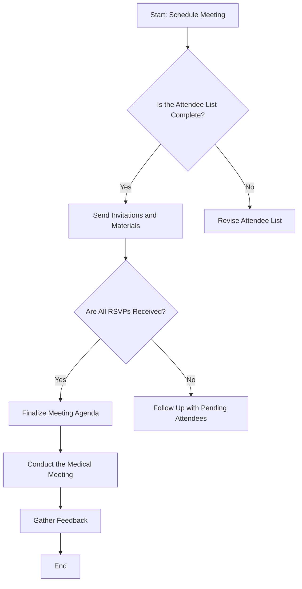

### Flowchart Explanation:

1. **Start**: The process begins with scheduling the medical meeting.
2. **Decision Point - Is the Attendee List Complete?**: Check if all necessary attendees are included in the list.
   - **Yes**: Proceed to sending invitations and materials.
   - **No**: Revise the attendee list until it is complete.
3. **Send Invitations and Materials**: Dispatch the meeting invitations along with any necessary documents for the attendees to review ahead of time.
4. **Decision Point - Are All RSVPs Received?**: Verify if all attendees have responded to the invitations.
   - **Yes**: Move on to finalizing the meeting agenda.
   - **No**: Follow up with attendees who have not yet responded.
5. **Finalize Meeting Agenda**: Set a final agenda for the meeting based on responses and any adjustments.
6. **Conduct the Medical Meeting**: Execute the meeting as planned.
7. **Gather Feedback**: After the meeting, collect feedback from attendees to assess the effectiveness and identify areas for improvement.
8. **End**: The process concludes.